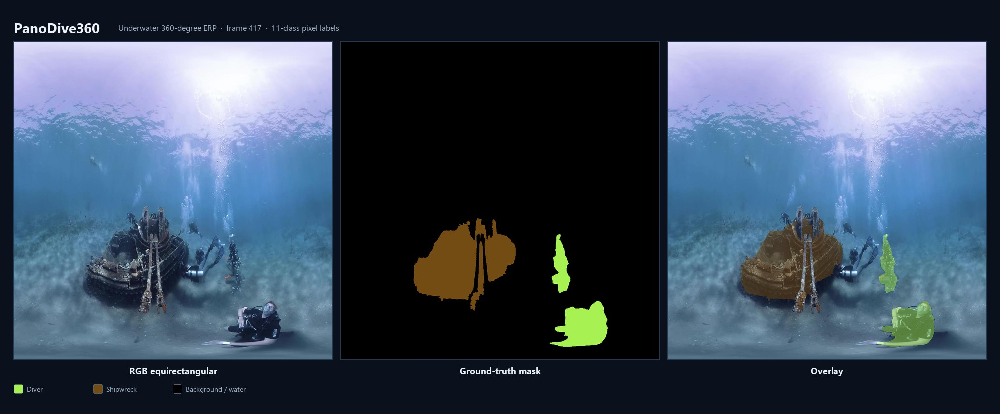

# PanoDive360



*Example ERP still (frame 417) with pixel labels for diver and shipwreck. The dataset has 11 classes in total.*

Equirectangular (ERP) dataset and CNN benchmark for **underwater 360-degree multiclass semantic segmentation**.

Almost all marine segmentation datasets assume a narrow-field pinhole camera. ERP 360-degree imagery removes blind spots, but it stretches objects near the poles, wraps instances across the image seam, and mixes low-visibility water with cluttered fauna. PanoDive360 is a pixel-annotated underwater ERP set and a first CNN baseline on that set.

This repository is the **code release** plus a small labeled example set. The full 1,052-frame archive is not in git. Six RGB stills and matching masks are in [`data/examples/`](data/examples/). Put the full split under `data/splits/` (see [data/README.md](data/README.md)).

## Repository layout

```text
PanoDive360/
├── train.py                 # training entry point
├── panodive360/             # models, loaders, losses, config
│   ├── config.py
│   ├── losses.py
│   ├── trainer.py
│   ├── data/                # Dataset class (not the image files)
│   └── models/              # CBAM, ERP-CBAM, DeepLabv3+ variants
├── preprocess/              # FFmpeg helpers (stereo→mono, frames, resize)
├── data/
│   ├── examples/{images,masks}/   # 6 labeled sample frames (in git)
│   ├── raw/
│   └── splits/{train,valid,test}/{images,masks}/
├── assets/                  # README figures
└── docs/diagrams/           # architecture diagram scripts
```

## Dataset (main contribution)

| Item | Value |
| --- | --- |
| Frames | 1,052 stills from 30 publicly shared 4K 360-degree videos |
| Projection | Monoscopic ERP, 2:1 aspect, pixel labels on the ERP image |
| Classes | 11 (10 foreground + background water) |
| Source | Publicly shared platforms such as YouTube (not public-domain by default) |
| Prep | Audio stripped; side-by-side / over-under converted to mono ERP; stills extracted with FFmpeg |

Foreground class counts and RGB colors are listed in [data/README.md](data/README.md). Diver is present in almost every frame; dolphin and sea turtle are rare. The set is strongly imbalanced.

## CNN benchmark (diagnostic, not a SOTA claim)

Shared-protocol CNNs in the paper: U-Net, U-Net++, PSPNet, DeepLabv3+, and ERP-CBAM (DeepLabv3+ / ResNet-34 with a latitude-weighted spatial attention block).

Relative to DeepLabv3+, ERP-CBAM raises mean IoU (0.536 → 0.606), recall (0.680 → 0.758), F1, Dice, and balanced accuracy. It is **not** best among these five CNNs on accuracy, precision, or MCC. Treat ERP-CBAM as a diagnostic baseline rather than a generally superior architecture.

Ablation in the paper: removing the latitude term can raise mIoU while the full ERP-CBAM setting is stronger on recall / balanced accuracy. That is a trade-off, not a uniform win.

## Setup

```bash
pip install -r requirements.txt
```

Install a CUDA build of PyTorch that matches your GPU from the [PyTorch install page](https://pytorch.org/get-started/locally/). Copy the split into `data/splits/` (or set `PANODIVE360_DATA`). Then, from the repo root:

```bash
python train.py
```

`train.py` trains DeepLabv3+ with ERP-CBAM (`panodive360/models/deeplab_erp_cbam.py`). Vanilla CBAM DeepLabv3+ is `panodive360/models/deeplab_cbam.py`. Checkpoints and TensorBoard logs go to `runs/` (or `PANODIVE360_RUNS`).

Preprocessing helpers:

```bash
python preprocess/stereo_to_mono.py
python preprocess/extract_frames.py
python preprocess/resize_images.py
```

Edit the placeholder paths at the bottom of each script before running them.

## License

Code: MIT (see `LICENSE`). Dataset media remain under their original platform terms; this repo does not redistribute the videos.
